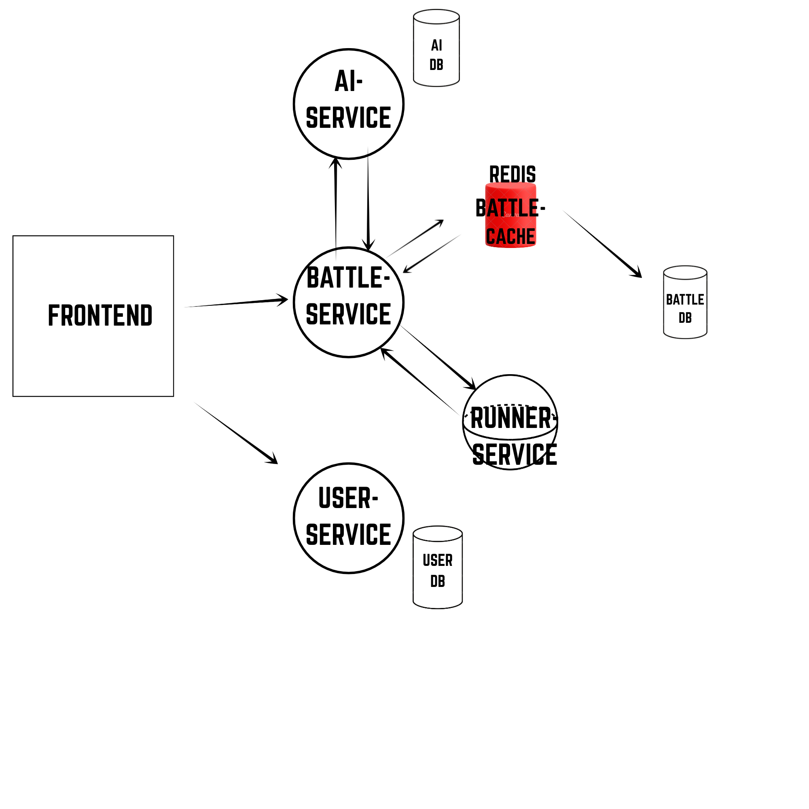

# LeetDecode – Distributed Competitive Coding & Analytics Platform

LeetDecode is a multi-tiered microservices platform that helps competitive programmers track their LeetCode profiles, manage multi-sheet DSA practice schedules, and battle friends in a realtime, point-based two-player coding mode.

🔗 **Live Demo:** [http://13.60.190.141/](http://13.60.190.141/)

---

## ✨ Features

- **Realtime Two-Player Battle Mode** – Challenge another user to a live, point-based coding battle with instant score updates.
- **LeetCode Profile Tracking** – Sync and monitor user LeetCode profiles and progress over time.
- **Multi-Sheet DSA Practice Tracker** – Organize and track progress across multiple curated DSA practice sheets.
- **Leaderboard & Stats** – Fast, cached leaderboard and user-stats views powered by a distributed Redis caching layer.
- **Independently Deployable Microservices** – Each core capability runs as its own service for scalability and fault isolation.

## 🏗️ Architecture

LeetDecode is built as a set of independently deployable microservices rather than a single monolith:

- **Battle Service** – Manages realtime two-player battle sessions and point-based scoring.
- **Profile & Sheets Service** – Tracks user LeetCode profiles and multi-sheet DSA practice progress.
- **Caching Layer (Redis)** – A distributed Redis cache sits in front of battle-view data, keeping scores and leaderboard updates fast and low-latency under concurrent load.

           

## 🛠️ Tech Stack

| Layer | Technology |
|---|---|
| Frontend | React |
| Backend | Spring Boot (Java), Microservices |
| Caching | Redis |
| Containerization | Docker |
| Deployment | AWS EC2 |

## ⚙️ Getting Started

### Prerequisites
- Java 17+
- Node.js 18+
- Docker & Docker Compose
- Redis

### Clone the repository
```bash
git clone https://github.com/rahulbhandarireal/leetcode-dashboard.git
cd leetdecode
```

### Run with Docker Compose
```bash
docker-compose up --build
```

This spins up all backend microservices, the Redis cache, and the frontend together.

### Run services individually (development)

**Backend (each microservice)**
```bash
cd <service-directory>
./mvnw spring-boot:run
```

**Frontend**
```bash
cd frontend
npm install
npm start
```

## 📈 Performance

The distributed Redis caching layer for battle-view and leaderboard data significantly reduces average API response time under concurrent load, keeping live battle scores and standings responsive even with many simultaneous users.

## 🚀 Deployment

The platform is containerized with Docker and deployed on an AWS EC2 instance, with all microservices provisioned and run for a scalable, reproducible production environment.

## 📄 License

This project is licensed under the MIT License.
